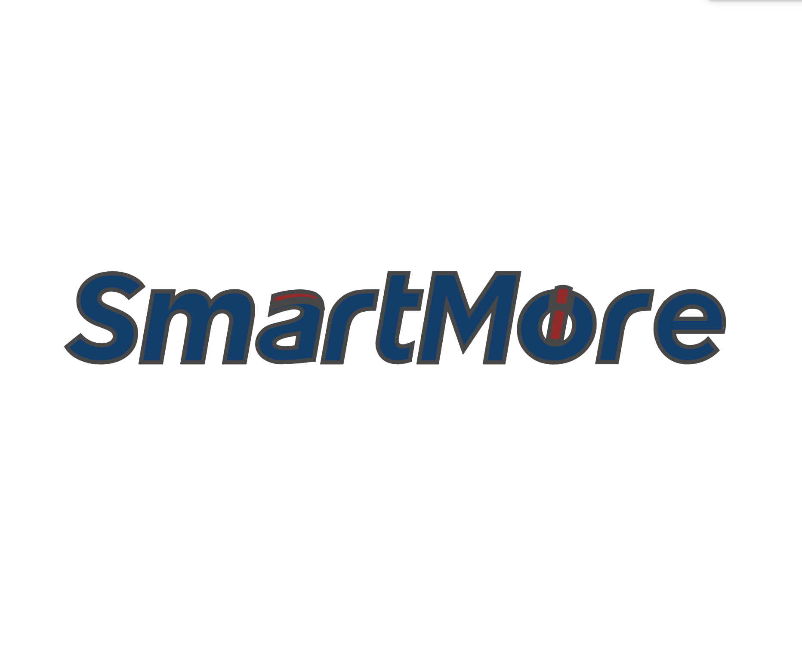
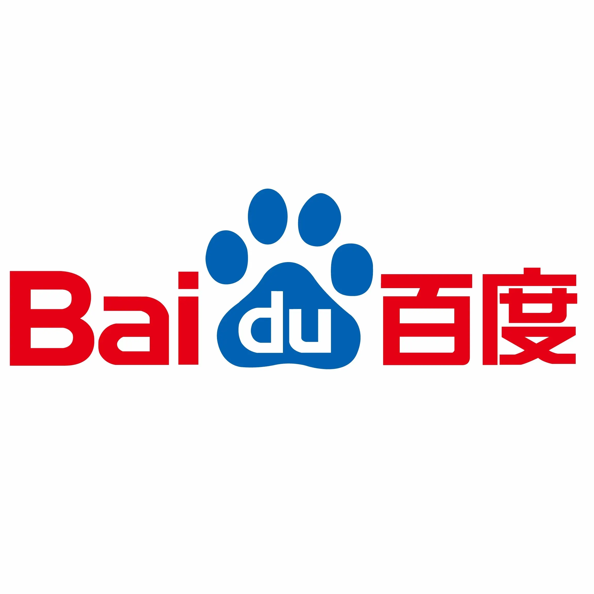

---
# An instance of the Blank widget.
# Documentation: https://wowchemy.com/docs/page-builder/
widget: blank

# This file represents a page section.
headless: true

# Order that this section appears on the page.
weight: 40

# Section title
title: Selected Publication

# Section subtitle
subtitle:

# Section design
design:
  # Use a 1-column layout
  columns: "1"
  # Use a dark navy background with light text.
  background:
    color: 'grey'
    text_color_light: False
---

   
  

            
    

    

    
  <b>SmartMore</b> 
      <i>Computer Vision Developer</i> 
      <i>Sep 2021 – Present  Hong Kong.</i>

    

 

	
  

			
	

	

    
   <b>Baidu Vis-Var</b> 
      <i>Research Intern</i> 
      <i>Feb 2022 – Present Remote.</i>

	

 

