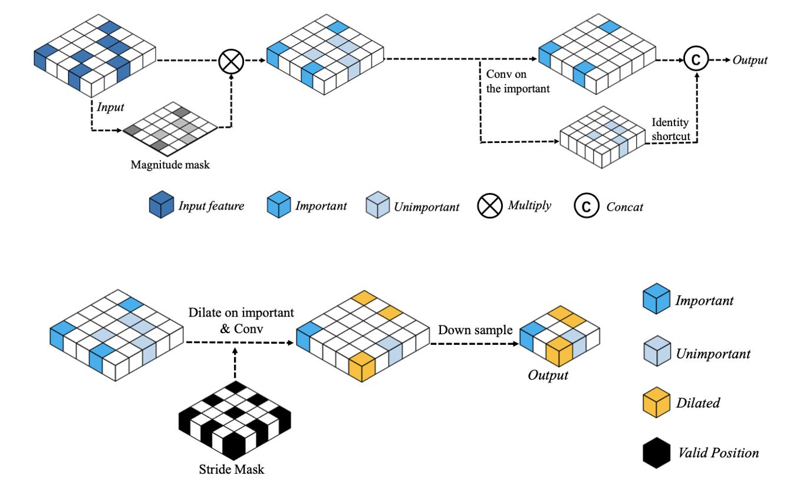

---
# An instance of the Blank widget.
# Documentation: https://wowchemy.com/docs/page-builder/
widget: blank

# This file represents a page section.
headless: true

# Order that this section appears on the page.
weight: 110

# Section title
title: Selected Publication

# Section subtitle
subtitle:

# Section design
design:
  # Use a 1-column layout
  columns: "1"
  # Use a dark navy background with light text.
  background:
    color: 'white'
    text_color_light: False
---

**Spatial Pruned Sparse Convolution for Efficient 3D Object Detection**\
_Jianhui Liu*_, _Yukang Chen*_, _Xiaoqing Ye_, _Zhuotao Tian_, _Xiao Tan_, _Xiaojuan Qi_\
_Conference on Neural Information Processing Systems (NeurIPS), 2022._

**Scaling up Kernels in 3D CNNs**\
_Yukang Chen*_, _Jianhui Liu*_, _Xiaojuan Qi_, _Xiangyu Zhang_, _Jian Sun_, _Jiaya Jia_\
_arxiv preprint_

**Stratified Transformer for 3D Point Cloud Segmentation**\
_Xin Lai*_, _Jianhui Liu*_, _Li Jiang_, _Liwei Wang_, _Hengshuang Zhao_, _Shu Liu_, _Xiaojuan Qi_, _Jiaya Jia_,\
_IEEE Conference on Computer Vision and Pattern Recognition (CVPR), 2022._

